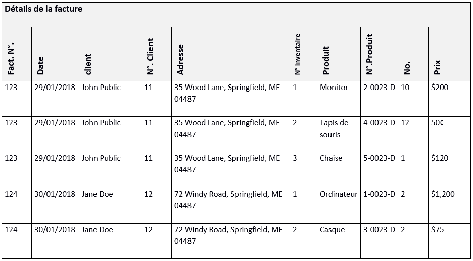
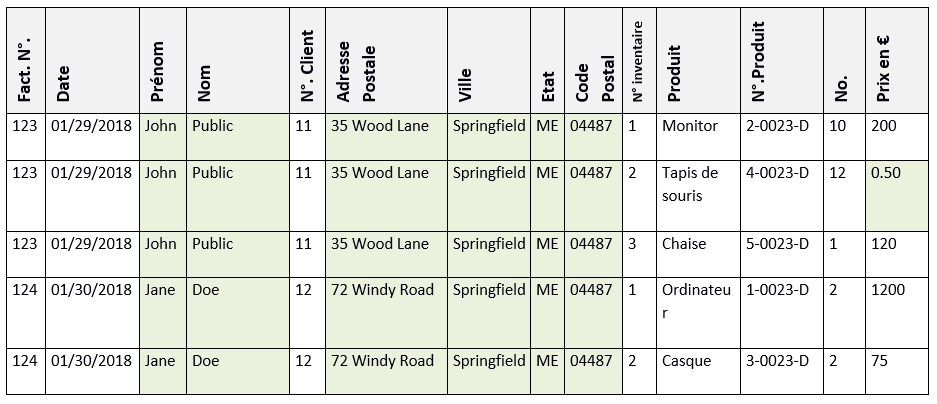

# Normalisation d'une base de données #

Ici nous avons un tableau représentant des factures.

L’enregistrer en bdd ainsi serait une perte de place et d’efficacité.  
Certaines informations ici sont redondante et n’ont pas lieux d’être enregistré autant de fois.
On parle ici de base de donnée "**dénormalisé**".

"**Normaliser**" une BDD signifie découper les informations en plusieurs tables. Ainsi que lisser les informations qu'elles contiennent selon certaines conventions.

## 1NF ##

> - *Chaque entrée doit être "Atomique"*
(une seule information doit être contenu dans une colonne.)
> - *Toute les valeurs de "même type"*
(on ne va pas mélanger des float avec des int, des yen avec des dollars.)

Avant Normalisation :

Après Normalisation :

Ici on a :

- séparé "nom" et "prénom"
- séparé "adresse", "ville", "état" et "code postal"
- changé le prix qui était en "cent" en "dollar"

## 2NF ##

> - *La table doit être conforme aux conventions de NF1.*
> - *Chaque attribut non clef doit être entièrement fonctionnel, en fonction de la clef primaire.*
(C'est à dire que si on regarde la clef primaire, chaque colonne doit être uniquement lié à celle ci.)

Ici on a trois colonnes qui peuvent servire de "**clef primaire**" on parle de "**clef candidate**".

"numéro de facture", "numéro de client" et "numéro d'inventaire".

Dans notre cas, on pourra créer une "**clef composite**" avec "**Numero de facture**" et "**numéro d'inventaire**".

Maintenant qu'on a notre "**clef primaire**", voyons si toute nos informations dépendent vraiment de cette clef.
Si on regarde, on a 8 colonnes qui se répètent et qui ne sont lié qu'au "**numéro de facture**"
On va donc séparer notre table en deux pour éviter la répétition

Le numéro de facture apparait sur les deux ce qui permet de faire le lien entre les deux tables.

## 3NF ##

> - *La table doit être conforme aux conventions de NF1 et NF2.*
> - *Aucun attribut non clef ne peut dépendre de façon transitoire d’un candidat clef.*
(C'est à dire que si on a des colonnes qui dépendent d'un candidat clef, autant faire une nouvelle table)

Dans l’exemple précédent on remarque encore une information qui pourrait servir de "**clef primaire**", le "**numéro de client**", c’est un "**candidat clef**". Or toute les informations liées au client dépendent de ce numéro de client.

On remarquera aussi que le "**nom du produit**" et son "**prix**" dépendent uniquement du "**numéro de produit**".
On découpera alors encore ces deux tables en 2 pour obtenir :

Et ils sont toujours lié les uns aux autres via leurs différentes clef.

Il existe jusqu’à 5 normalisation (Plus une optionnelle), mais déjà respecter les trois premières permet d'avoir une BDD fonctionnelle et efficace.

Il existe aussi certains cas spécifique où il est normal de réduire la normalisation.
